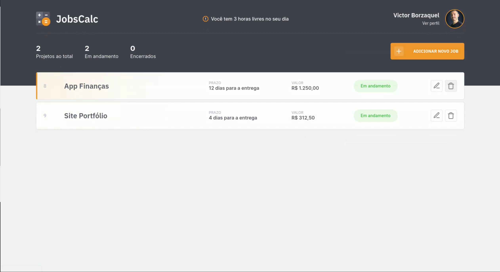
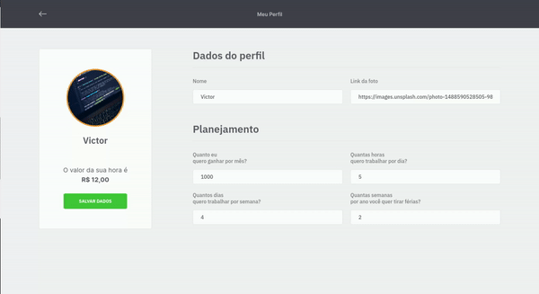
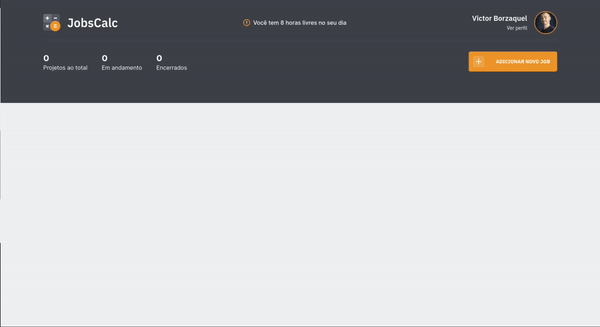
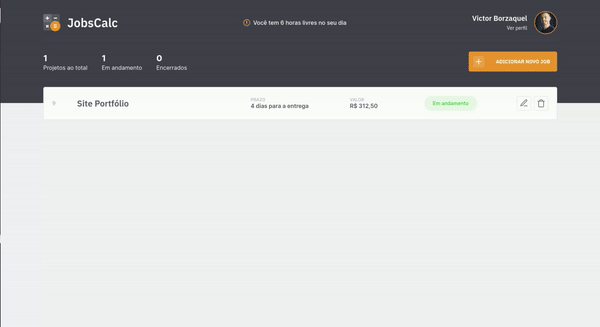
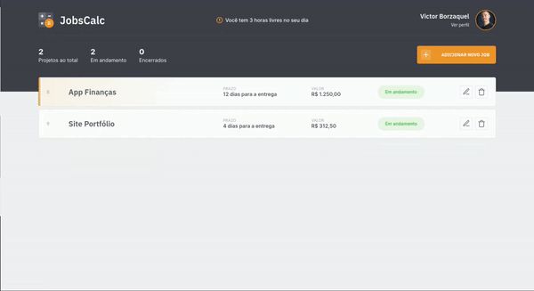

# JobsCalc

Site para calcular quanto você tem que cobrar por cada trabalho e quantos dias vai levar para concluir.

## Técnologias utilizadas:

- **EJS** - Para criar o Front-end.
- **SQLite** - Para fazer o banco de dados.
- **Node + Express** - Para fazer a API.

## Utilização

### Cadastro Perfil

Primeiro você cadastra o seu perfil, e com esses dados é calculado quanto custa a sua hóra de trabalho.

**Dados**

- Foto
- Nome
- Quanto deseja ganhar por mês
- Quantas horas trabalhar por dia
- Quantos dias trabalha por semana
- Quantas semanas quer de férias por mês

### Adicionar Job

Depois basta adicionar seus jobs, que vai calcular o quanto você deve cobrar pelo serviço e quando é a previsão de entrega.

**Dados**

- Nome do job
- Quantas horas por dia vai trabalhar nesse job
- Quantas horas estimadas vai precisar para fazer o job

### Editar Job

Se você escreveu algo errado, também tem a função de editar seus jobs.

### Deletar Job

Por ultimo, é possivel deletar seus jobs passados ou que você não vai mais fazer.

